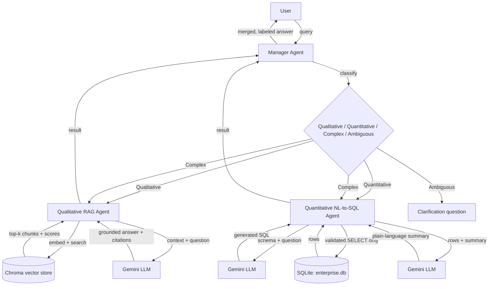

# Multi-Agent RAG System for Enterprise Documentation

A Python CLI (and optional HTTP API) that answers enterprise questions by routing
them to the right specialist agent: a qualitative RAG agent for policy/process
questions, a quantitative NL-to-SQL agent for data questions, or both at once for
complex questions that need both.

## Architecture



### Agent roles

- **Manager Agent** (`manager_agent.py`) classifies each query as `QUALITATIVE`,
  `QUANTITATIVE`, `COMPLEX`, or `AMBIGUOUS` (LLM-based, with a keyword-based
  fallback if the LLM call fails or returns an unparseable label). For `COMPLEX`
  queries it calls both sub-agents and merges their answers into one response,
  labeling which agent handled which part. For `AMBIGUOUS` queries it asks a
  clarifying question instead of guessing.
- **Qualitative RAG Agent** (`qualitative_agent.py`) embeds the query with a
  sentence-transformer, retrieves the top-k chunks from a Chroma vector store
  built over `data/docs/`, drops any chunk below a minimum similarity threshold,
  and asks the LLM to answer using only the retrieved chunks. Every answer
  includes the source document IDs and similarity scores it was grounded in.
- **Quantitative NL-to-SQL Agent** (`quantitative_agent.py`) gives the LLM the
  SQLite schema and the question, gets back a SQL query, validates that it's a
  single read-only `SELECT` (rejecting anything else before it ever reaches the
  database), executes it, and asks the LLM for a plain-language summary of the
  result.

## Setup

```bash
python3.11 -m venv .venv
source .venv/bin/activate
pip install -r requirements.txt
pip install -e .
cp .env.example .env   # then fill in GEMINI_API_KEY
python scripts/build_database.py
python scripts/ingest_docs.py
```

## Usage

**Single query:**

```bash
multiagent "What is our company's security policy?"
```

**Interactive mode:**

```bash
multiagent
> Show me monthly revenue trends
> exit
```

**HTTP API:**

```bash
uvicorn multiagent.api:app --app-dir src
```

Swagger UI is at `http://127.0.0.1:8000/docs`. Routes: `GET /health`,
`POST /query` (manager), `POST /qualitative/query`, `POST /quantitative/query`.

## Supported query types

| Type | Example | Routed to |
|---|---|---|
| Qualitative | "Explain the code review process" | Qualitative RAG Agent |
| Quantitative | "What's our customer churn rate?" | Quantitative NL-to-SQL Agent |
| Complex | "How does employee satisfaction compare and what policies affect it?" | Both, merged |
| Ambiguous | "tell me stuff" | Clarification question |

## Testing

```bash
pytest tests/ -v
```

39 tests cover each agent in isolation (with a fake LLM client so tests are fast,
deterministic, and don't consume API quota), SQL safety validation, vector store
retrieval, the LLM client's retry behavior, CLI output formatting, the FastAPI
routes, and full end-to-end integration for all four query types.

## GenAI fundamentals I applied

**Stopping hallucinations.** I told the qualitative agent to only answer from
the documents it retrieved, and to say so if the answer isn't in there. I also
added a minimum similarity score (0.3) so if nothing relevant comes back, it
just says "not found" instead of letting the model make something up.

**Not trusting generated SQL.** The LLM writes the SQL, but I don't run it
blindly. Before it touches the database, I check that it's a single `SELECT`
statement and nothing else — since an LLM asked to write SQL could in theory
be pushed into writing something destructive.

**A real bug I ran into: token budgets.** While testing, my answers kept
getting cut off mid-sentence. It turned out the Gemini model spends part of
its token budget on internal reasoning I never see, so a `max_tokens` value
sized just for the visible answer was running out before the model finished
(`finish_reason: length`). I fixed it by giving it a much bigger budget.

**How the agents use tools.** Neither agent just asks the LLM a question and
returns whatever comes back. The LLM decides what to search for or what SQL
to write, then a real tool (the vector store or the database) actually does
the lookup, and only then does the LLM turn that result into an answer. The
CLI and the API both call the same agents, so the logic isn't duplicated.

**Handling vague questions.** If a question is too unclear to route, the
manager doesn't just guess — it asks a clarifying question instead, since
guessing usually means calling the wrong agent.

## Project layout

```
src/multiagent/
    manager_agent.py       classification, routing, response merging
    qualitative_agent.py   retrieval + threshold + grounded generation
    quantitative_agent.py  NL-to-SQL + safe execution + summarization
    vector_store.py        Chroma wrapper and document chunking
    sql_tools.py            schema introspection + SELECT-only validation
    llm_client.py           Gemini client with retry on transient errors
    logging_config.py       structured (JSON) logging
    schemas.py               shared Pydantic models (CLI + API)
    factory.py                wires agents together from settings
    cli.py                     command-line interface
    api.py                     FastAPI routes
data/
    docs/                       enterprise documentation (RAG source)
    enterprise.db               SQLite database (generated)
scripts/
    build_database.py          generates the SQLite database
    ingest_docs.py               ingests data/docs/ into the vector store
tests/                            unit + integration test suite
```
