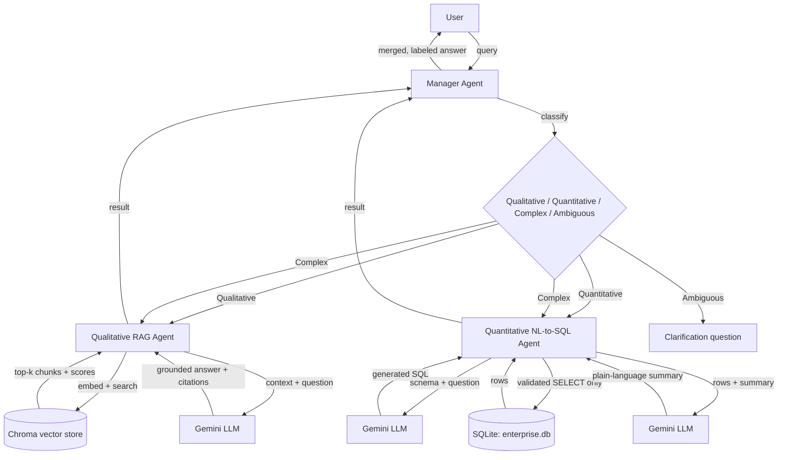

# Multi-Agent RAG System for Enterprise Documentation

A Python CLI (and optional HTTP API) that answers enterprise questions by routing
them to the right specialist agent: a qualitative RAG agent for policy/process
questions, a quantitative NL-to-SQL agent for data questions, or both at once for
complex questions that need both.

## Architecture



### Agent roles

- **Manager Agent** (`manager_agent.py`) classifies each query as `QUALITATIVE`,
  `QUANTITATIVE`, `COMPLEX`, or `AMBIGUOUS` (LLM-based, with a keyword-based
  fallback if the LLM call fails or returns an unparseable label). For `COMPLEX`
  queries it calls both sub-agents and merges their answers into one response,
  labeling which agent handled which part. For `AMBIGUOUS` queries it asks a
  clarifying question instead of guessing.
- **Qualitative RAG Agent** (`qualitative_agent.py`) embeds the query with a
  sentence-transformer, retrieves the top-k chunks from a Chroma vector store
  built over `data/docs/`, drops any chunk below a minimum similarity threshold,
  and asks the LLM to answer using only the retrieved chunks. Every answer
  includes the source document IDs and similarity scores it was grounded in.
- **Quantitative NL-to-SQL Agent** (`quantitative_agent.py`) gives the LLM the
  SQLite schema and the question, gets back a SQL query, validates that it's a
  single read-only `SELECT` (rejecting anything else before it ever reaches the
  database), executes it, and asks the LLM for a plain-language summary of the
  result.

## Setup

```bash
python3.11 -m venv .venv
source .venv/bin/activate
pip install -r requirements.txt
pip install -e .
cp .env.example .env   # then fill in GEMINI_API_KEY
python scripts/build_database.py
python scripts/ingest_docs.py
```

## Usage

**Single query:**

```bash
multiagent "What is our company's security policy?"
```

**Interactive mode:**

```bash
multiagent
> Show me monthly revenue trends
> exit
```

**HTTP API:**

```bash
uvicorn multiagent.api:app --app-dir src
```

Swagger UI is at `http://127.0.0.1:8000/docs`. Routes: `GET /health`,
`POST /query` (manager), `POST /qualitative/query`, `POST /quantitative/query`.

## Supported query types

| Type | Example | Routed to |
|---|---|---|
| Qualitative | "Explain the code review process" | Qualitative RAG Agent |
| Quantitative | "What's our customer churn rate?" | Quantitative NL-to-SQL Agent |
| Complex | "How does employee satisfaction compare and what policies affect it?" | Both, merged |
| Ambiguous | "tell me stuff" | Clarification question |

## Testing

```bash
pytest tests/ -v
```

39 tests cover each agent in isolation (with a fake LLM client so tests are fast,
deterministic, and don't consume API quota), SQL safety validation, vector store
retrieval, the LLM client's retry behavior, CLI output formatting, the FastAPI
routes, and full end-to-end integration for all four query types.

## GenAI fundamentals applied

- **Hallucination mitigation**: the qualitative agent is explicitly prompted to
  answer only from retrieved context and to say when the context doesn't
  contain the answer, and a minimum similarity threshold (default 0.3) rejects
  weak matches before they ever reach the LLM, returning a clear "not found"
  message instead of letting the model guess.
- **SQL injection / unsafe generation**: LLM-generated SQL is never trusted
  directly. `sql_tools.validate_select_only` rejects anything that isn't a
  single `SELECT` statement before it touches the database, since an LLM asked
  to "write SQL" can in principle be prompted or drift into writing destructive
  statements.
- **Token budget vs. reasoning overhead**: this project surfaced a real
  failure mode worth documenting: the configured Gemini model spends part of
  its `max_tokens` budget on hidden reasoning tokens not visible in the
  response content, so a `max_tokens` value sized only for the visible answer
  silently truncates the output (`finish_reason: length`) well before the
  model finishes. Token budgets are set generously to leave room for both.
- **Agent-tool pattern**: each agent is a thin orchestrator around external
  tools (a vector index, a SQL database) rather than a bare LLM call. The LLM
  decides *what* to retrieve or *what query* to run, but never directly
  produces the final answer without a tool call grounding it, and the same
  routing logic is reused by both the CLI and the API.
- **Ambiguity handling**: rather than forcing every query into qualitative or
  quantitative, the manager can classify a query as ambiguous and ask a
  clarifying question, since guessing on an underspecified query is a common
  source of irrelevant tool calls.

## Project layout

```
src/multiagent/
    manager_agent.py       classification, routing, response merging
    qualitative_agent.py   retrieval + threshold + grounded generation
    quantitative_agent.py  NL-to-SQL + safe execution + summarization
    vector_store.py        Chroma wrapper and document chunking
    sql_tools.py            schema introspection + SELECT-only validation
    llm_client.py           Gemini client with retry on transient errors
    logging_config.py       structured (JSON) logging
    schemas.py               shared Pydantic models (CLI + API)
    factory.py                wires agents together from settings
    cli.py                     command-line interface
    api.py                     FastAPI routes
data/
    docs/                       enterprise documentation (RAG source)
    enterprise.db               SQLite database (generated)
scripts/
    build_database.py          generates the SQLite database
    ingest_docs.py               ingests data/docs/ into the vector store
tests/                            unit + integration test suite
```
